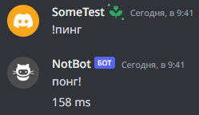
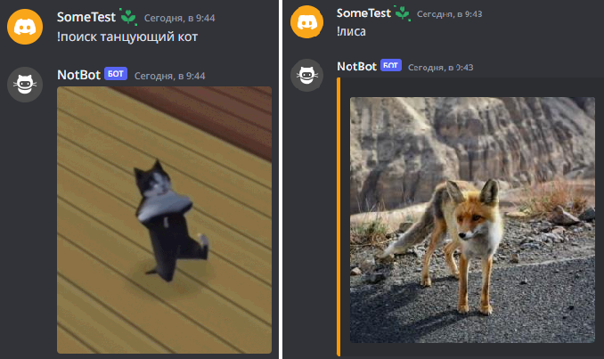
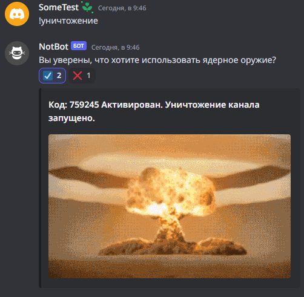
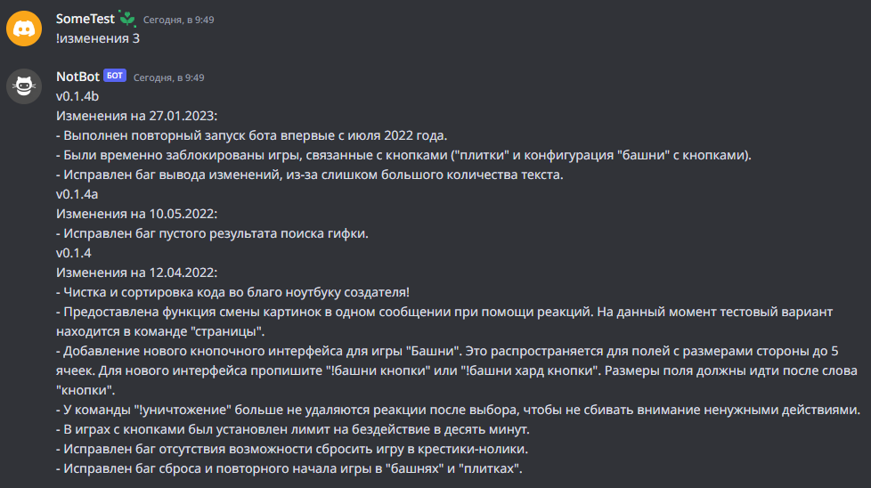
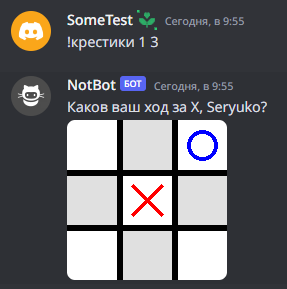
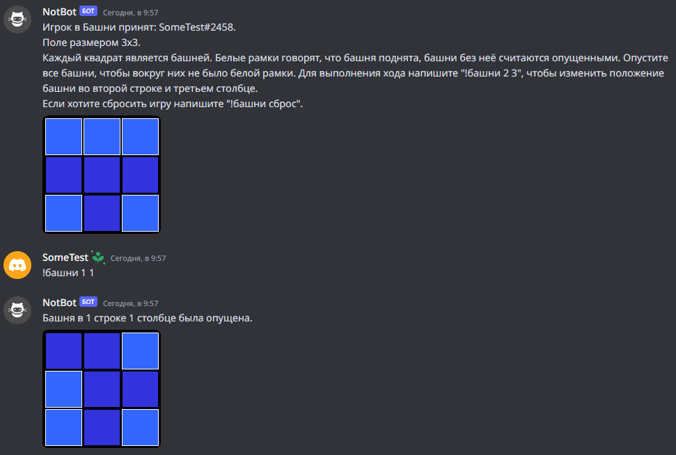
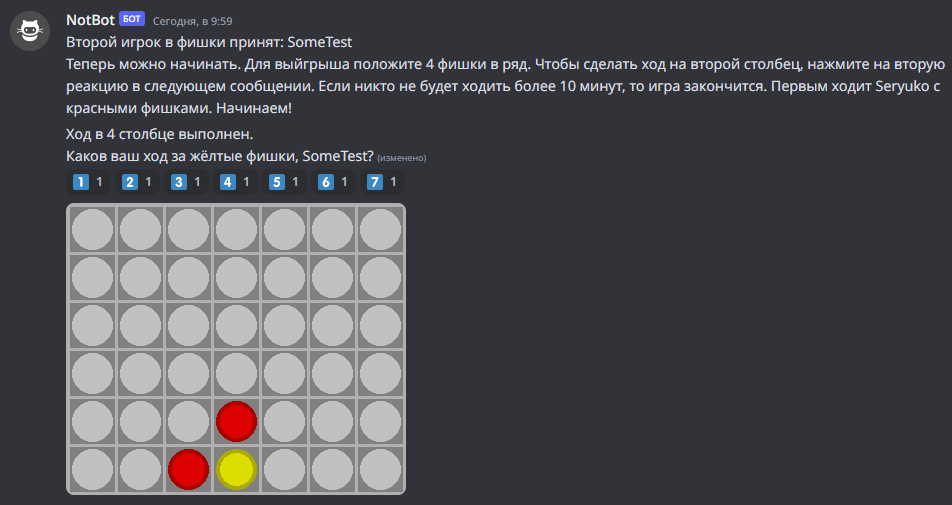
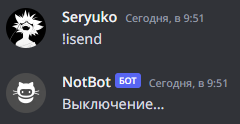
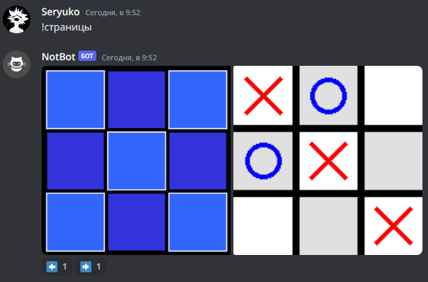

# NotBot

 
Это личный проект для дружеского дискорд-сервера с поиском гифок, разными играми для чата и другими простыми функциями.
   

## Список команд:

В качестве начальной команды следует просмотреть список команд:

0) `!помощь` или `!help` - покажет все команды, доступные пользователям.

### Простые команды

1) `!пинг` - Проверка работы и соответственно пинга.

2) `!привет` - Приветствие. Для нескольких пользователей сделаны особые приветствия с несколькими вариациями.

3) `!рандом X Y` - Генерирует случайное число от X до Y.

 

### Поиск картинок и гифок

4) `!лиса` - Показывает случайную картинку с лисой.

5) `!котик` - Показывает случайную картинку с котиком.

6) `!собака` - Показывает случайную картинку с собакой.

7) `!панда` - Показывает случайную картинку с пандой.

8) `!поиск X` - Случайная гифка из 30 самых популярных по запросу Х с сайта tenor.com.

 

### Специфичные

9) `!время` - Можно узнать, сколько длится текущий сеанс между перезагрузками.

10) `!уничтожение` - "Вы действительно хотите уничтожить этот канал? Только не ожидайте чего-то грандиозного. У меня прав нет на полный хаос. (-.-)"

11) `!отзыв X` - Оставьте отзыв или предложения вместо Х. Для прочтения всех отзывов пропишите "!отзыв чтение".

12) `!изменения X` - Вывод последних X изменений в программе. Без Х выведет одно последнее обновления.

### Игры

1) `!крестики Y X` - Принять участие в игре крестики-нолики друг против друга. Y - размер поля, X - длина победной линии (от 3 до 10). По умолчанию Y и X равны трем, если прописать команду без Y и X. Для игры с самим собой пропишите команду дважды.

2) `!башни Y X` - Принять участие в одиночной игре Башни. Y - количество строк, Х - количество столбцов (от 2 до 10). По умолчанию Y и X равны трем, если прописать команду без Y и X.

3) `!башни хард Y X` - Усложнённый режим игры "Башни" по тем же правилам, но с добавлением нескольких особенностей. 

4) `!фишки` - Принять участие в игре "Четыре в ряд", где два человека по очереди скидывают фишки на поле 7х6, чтобы собрать 4 фишки в линию.

### Скрытые

Имеются и некоторые скрытые команды, но они доступны для использования только создателю бота. Например, есть !isend, который выключит бота.

Сюда же входят команды, которые находятся в разработке. Одна из них позволяет в одном сообщении хранить несколько "страниц" изображений, которые можно переключать выставляемыми эмоциями.

## Проверка

Есть возможность просмотреть работу команд на [сервере](https://discord.gg/bdNKtFhZae) или [добавить бота](https://discord.com/api/oauth2/authorize?client_id=870126995726549043&permissions=60416&scope=bot) на свой сервер.

## Выполнял:

Студент группы 739-1

[Васильев Егор](https://github.com/EggOrNo)
